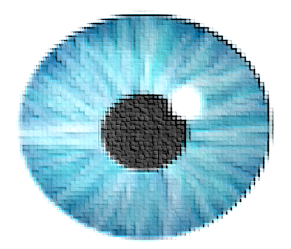

# contextlens


## Overview




`contextlens` is differential loop calling package in `R`. The package identifies differential loops based on local background from Hi-C data. This package includes functions to select desired local background and utilizing those to normalize the center loop pixel to call differential loops.

## Citations
To cite `contextlens` in publications use:

`contextlens` : differntial loop calling based on local context in R

## Installation

`contextlens` can be installed from `Bioconductor version 3.16`

`(R version 4.2)` as follows:

```R
if (!requireNamespace("BiocManager", quietly = TRUE))
    install.packages("BiocManager")

BiocManager::install(version = "3.16")

BiocManager::install("contextlens")
Example datasets and files are included with the package contextlensData:

BiocManager::install("contextlens")
```
## Usage

```R
## Load libraries and datasets
library(strawr)
library(devtools)
library(mariner)
library(SummarizedExperiment)
library(DelayedArray)
library(BiocParallel)
library(InteractionSet)
library(DESeq2)
```
